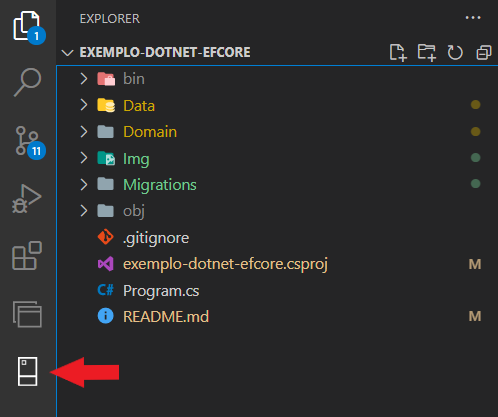
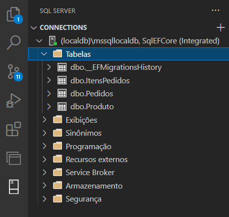

## Introdução

Sabemos que ao criar novas features ou corrigir um bug pode surgir a necessidade de uma alteração no banco de dados, migrations é um recurso do EF Core que utilizamos para versionar o modelo de dados proporcionando assim um controle maior do banco de dados e mantendo a sincronia entre o banco e a aplicação. Neste artigo iremos abordar como criar e remover migrações no EF Core.


## Pré-Requisitos
- .NET 6
- SQl Server Express 2019 (LocalDB) [Microsoft Docs](https://docs.microsoft.com/pt-br/sql/database-engine/configure-windows/sql-server-express-localdb?view=sql-server-ver15)
- VS Code
- Extensão SQL Server (mssql) [Microsoft Docs](https://docs.microsoft.com/pt-br/sql/tools/visual-studio-code/sql-server-develop-use-vscode?view=sql-server-ver15)


## Criando o projeto

Com o comando **`dotnet new console`** vamos criar um projeto console, o parâmetro **`-o`** indica o nome da pasta onde o projeto será criado.

    dotnet new console -o exemplo-dotnet-efcore


## Instalando o pacote Sql Server

O comando  **`dotnet add package`** adiciona pacotes ao projeto, Os comandos precisam ser executados na mesma pasta do arquivo .csproj, vamos adicionar o pacote do Sql Server com o seguinte comando:

    dotnet add package Microsoft.EntityFrameworkCore.SqlServer

O EF Core oferece duas opções de mapeamento, Code First e Database First:

### Code First

Code First é a abordagem mais comum onde o banco de dados é gerado a partir do código, utilizando Data Annotations que são atributos adicionados na sua classe, ou Fluent API que são métodos de extensão que oferece mais opções de configuração para criar mapeamentos mais completos de suas tabelas. *A nível de exemplo vamos utilizar Data Annotations*.
### Database First
No Database First o processo de mapeamento é diferente do Code First, a partir de um banco de dados existente o Ef Core utiliza o processo Scaffold para gerar classes C# em seu projeto, em determinadas configurações é necessário realizar algumas correções.

Nesse exemplo vamos utilizar o Code First.

## Classes
Vamos criar uma pasta **`Domain`** e dentro dela vamos criar três classes para o exemplo:

Produto.cs

```cs
using System.ComponentModel.DataAnnotations;
using System.ComponentModel.DataAnnotations.Schema;

namespace exemplo_dotnet_efcore.Domain
{
    [Table("Produto")]
    public class Produto
    {
        [Key]
        public int Id { get; set; }

        [Required]
        [Column(TypeName="varchar(200)")]
        public string Nome { get; set; }

        [Column(TypeName="varchar(200)")]      
        public string Descricao { get; set; }

        [Required]
        public decimal Valor { get; set; }
    }
}
```

ItemPedido.cs

```cs
using System.ComponentModel.DataAnnotations;
using System.ComponentModel.DataAnnotations.Schema;

namespace exemplo_dotnet_efcore.Domain
{
    [Table("ItensPedidos")]
    public class ItemPedido
    {
        [Key]
        public int Id { get; set; }
        public int PedidoId { get; set; }
        public Pedido Pedido { get; set; }
        public int ProdutoId { get; set; }
        public Produto Produto { get; set; }
        public int Quantidade { get; set; }
    }
}
```

Pedido.cs

```cs
using System.ComponentModel.DataAnnotations;
using System.ComponentModel.DataAnnotations.Schema;

namespace exemplo_dotnet_efcore.Domain
{
    [Table("Pedidos")]
    public class Pedido
    {
        [Key]
        public int Id { get; set; }
        public ICollection<ItemPedido> Itens { get; set;}
    }
}
```

## DbContext

DbContext é a classe mais importante para o EF Core, utilizando métodos para gravar e ler informações, essa classe tem como objetivo facilitar a interação da aplicação com o banco de dados.

Vamos criar uma pasta **`Data`** com o arquivo **`ApplicationContext`** que herda **`DbContext`** de **`Microsoft.EntityFrameworkCore`**.

ApplicationContext.cs

```cs
using exemplo_dotnet_efcore.Domain;
using Microsoft.EntityFrameworkCore;

namespace exemplo_dotnet_efcore.Data
{
    public class ApplicationContext : DbContext
    {

        public DbSet<Pedido> Pedidos { get; set; }
        public DbSet<Produto> Produtos { get; set; }
        public DbSet<ItemPedido> ItensPedidos { get; set; }

        protected override void OnConfiguring(DbContextOptionsBuilder optionsBuilder)
        {
            optionsBuilder.UseSqlServer("Data source=(localdb)\\mssqllocaldb;Initial Catalog=SqlEFCore; Integrated Security=true");
        }
    }
}
```

Para trabalhar com as migrations precisamos instalar no projeto os pacotes **`Microsoft.EntityFrameworkCore.Design`** e **`Microsoft.EntityFrameworkCore.Tools`** para disponibilizar as ferramentas necessárias.

    dotnet add package Microsoft.EntityFrameworkCore.Design

    dotnet add package Microsoft.EntityFrameworkCore.Design


## EF Core Global Tool

Vamos instalar também a ferramenta Global do EF Core utilizando o comando **`dotnet tool install`** com o parâmetro **`--global`**.

    dotnet tool install --global dotnet-ef 


Para conferir a instalação podemos usar o comando **`dotnet ef`**.

    dotnet ef


## Criando uma Migration

Para criar a primeira migração vamos utilizar o comando **`dotnet ef migrations add`** informando o nome da migração como **`PrimeiraMigracao`**.

    dotnet ef migrations add PrimeiraMigracao

Esse comando cria uma pasta **`Migrations`** com três arquivos, os arquivos gerados possui um timestamp do momento da execução do comando:


O arquivo  **`20220115164423_PrimeiraMigracao.cs`** possui dois métodos importantes **`protected override void Up(MigrationBuilder migrationBuilder)`** responsável pelas mudanças que vão ser realizadas, e **`protected override void Down(MigrationBuilder migrationBuilder)`** responsável para reverter essas modificações se houver necessidade.

O arquivo **`20220115164423_PrimeiraMigracao.Designer.cs`** é uma cópia (versionamento) do nosso modelo de dados  feita no momento que o comando de migration é executado

O arquivo **`ApplicationContextModelSnapshot.cs`** é criado apenas uma vez e possui o status atual do modelo de dados, toda vez que gerar uma nova migração esse arquivo será modificado.

## Aplicando uma Migration no banco de dados

Vamos utilizar o comando **`dotnet ef database update`** passando o parâmetro **`-v`** para mostrar na tela os comandos que estão sendo executados no banco de dados.

    dotnet ef database update -v

Podemos conferir se as modificações foram aplicadas no banco utilizando a extensão SQL Server (mssql) no VS Code:



Adicione uma conexão utilizando a extensão, 
alguns parâmetros são opcionais podemos apenas apertar enter e prosseguir, use os seguintes parâmetros:

- Server name: (localdb)\mssqllocaldb
- Database name: SqlEFCore
- Authentication Type: Integrated

Os valores devem está de acordo com a connection string informada no **`optionsBuilder.UseSqlServer("Data source=(localdb)\\mssqllocaldb;Initial Catalog=SqlEFCore; Integrated Security=true");`** do arquivo **`ApplicationContext.cs`**


Teremos o seguinte resultado:




## Como Desfazer Migrações

Em determinadas situações precisamos fazer o rollback de uma migração, o EF Core oferece essa opção através do comando **`dotnet ef database update`** informando o nome da migração que deseja realizar o rollback, para remover a migração inicial podemos informar o valor **`0`** no lugar do nome da migração que vai retornar nosso banco para o ponto inicial.

    dotnet ef database update 0

Em seguida utilizamos o comando **`dotnet ef migrations remove`** para remover o arquivo de migração que foi gerado no projeto.

    dotnet ef migrations remove

## Conclusão 

O Ef Core através das Migrações oferece de forma simples e segura de manter o banco de dados sincronizado com o modelo da aplicação agilizando o desenvolvimento de software que está em constante evolução. Existem outros recursos e funcionalidades que não foram apresentadas neste artigo, para mais informações consulte a documentação oficial [Microsof Docs](https://docs.microsoft.com/pt-br/ef/core/managing-schemas/migrations/?tabs=dotnet-core-cli).

